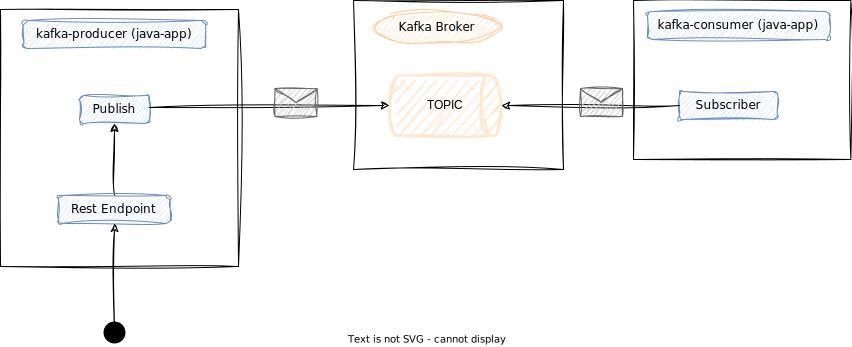

### Ola! 👋 

# Spring Boot

<a href="https://www.youtube.com/watch?v=hQ2JpAMadEk">
    
</a>


> [!NOTE]
> A proposta deste repositório é fornecer com base na framework do Spring Boot exemplos práticos:

1. **Segurança - Micro-Serviços**

    Projeto que compõem a etapa de autenticação/autorização na arquitetura de micro-serviços. O processo abaixo visa ilustrar o procedimento para consumir o serviço de criação do usuário pela API Usuário.
    
    


2. **Mensageria com Rabbit MQ**

    Utilizando o modelo tradicional de mensageria, no qual as mensagens são enviadas para filas e roteadas pelo Exchange(topic, fane out, direct) para os consumidores. Ele é adequado para cenários onde desejamos a garantia da entrega da mensagem.

    

3. **Mensageria com Kafka**

    Sistemas de comunicação assíncrona Pub/Sub para processamento de fluxo de eventos em tempo real e ingestão de dados em grande escala, utilizando partições (partitions) ele pode ser facilmente escalável no sentido horizontal.
       
     

4. **Spring Security LDAP / Bcrypt (Mysql)**
    
    Após usuário submeter suas credênciais através do formulário de login, o Spring Security inicia o processo de autenticação validando os dados informados pelo usuário no OpenLdap ou MySQL (utilizando Bcrypt).    

   

> [!IMPORTANT]
> Necessário ter instalado na máquina as ferramentas.

- Docker v25.0.xxx
- Docker Compose v2.24.xxx
- Git v1.8.x.x
- Postman
- S.O. Windows 10 Pro (19045.4046) ou Ubuntu 18.04 LTS (Bionic Beaver)

> [!IMPORTANT]
> Para iniciar todos os projetos, é recomendável que o computador tenha pelo menos **3GB de memória disponível**.


## Iniciar

Para baixar as imagens docker, é necessário primeiro clonar o repositório e autenticar-se no GitHub Container Registry (GHCR).

1. Clonar Projeto

```sh
$ git clone https://github.com/ramiralvesmelo/spring-boot-images.git
$ cd spring-boot-images
```

2. Autenticar GHCR

> [!IMPORTANT]
> A chave de acesso dever ser solicitada ao administrador da conta.

```sh
$ docker login ghcr.io -u ramiralvesmelo 
```

## Importar Collection 

Importar as collections para o Postman.

- <a href="spring-boot-kafka/spring-boot-kafka.postman_collection.json">spring-boot-kafka.json</a>
- <a href="spring-microservico/spring-microservico.postman_collection.json">spring-microservico.json</a>
- <a href="spring-boot-rabbitmq/spring-boot-rabbitmq.postman_collection.json">spring-boot-rabbitmq.json</a>

## Acesso as Portas

> [!CAUTION]
> Para evitar conflitos de porta, a seguir está uma lista completa das portas utilizadas.


### Spring Security + LDAP

| Aplicação     | Porta         | Descrição                 |
| :------------ |:-------------:| :----------------------   |
| App-Web       | 8081          | Aplicação de front-end.   |
| Open LDAP     | 10389, 10636  | Servidor LDAP.            |

### Apache Kafka

| Aplicação         | Porta         | Descrição                                                 |
| :-----------------|:-------------:| :----------------------                                   |
| Apache ZooKeeper  | 22181         | Centralizador de chamados em um ambiente de cluster.      |
| Apache Kafka-MB   | 9092, 9099    | Servidor Message Broker.                                  |
| kafka-ui          | 8084          | Interface de monitoração.                                 |
| kafka-producer    | 8085          | Aplicação responsável pelo envio da mensagem.             |
| kafka-cosumer     | 8086          | Aplicação responsável pelo recebimento da mensagem.       |

### RabbitMQ 

| Aplicação         | Porta         | Descrição                                                         |
| :-----------------|:-------------:| :----------------------                                           |
| Rabbit MQ         | 5672, 15672   | Servidor Message Broker.                                          |
| rabbitmq-consumer | 8082          | Aplicação (publish) responsável pelo envio da mensagem.           |
| rabbitmq-producer | 8083          | Aplicação (subscribe) responsável pelo recebimento da mensagem.   |

### Segurança Micro-Serviços

| Aplicação         | Porta         | Descrição                         |
| :-----------------|:-------------:| :----------------------           |
| api.auth          | 8087          | API de autenticação               |
| api.usuar         | 8088          | API de acesso a entidade Usuário  |
| MySQL             | 3306          | Banco de dados Relacional.        | 


## Enpoints

### Spring Security + LDAP 

- http://127.0.0.1:8081/     

    - Usuário / Senha: guest<br><br>

        

    - Apache Directory Studio<br><br>

        
    
### Apache Kafka

- <a href="spring-boot-kafka/spring-boot-kafka.postman_collection.json">spring-boot-kafka.json</a>
- http://127.0.0.1:8084/

    

### RabbitMQ 

 - <a href="spring-boot-rabbitmq/spring-boot-rabbitmq.postman_collection.json">spring-boot-rabbitmq.json</a>
 - http://127.0.0.1:15672/

    - Usuário / Senha: guest

        

 

### Segurança Micro-Serviços + Bcrypt (Mysql)

 - <a href="spring-microservico/spring-microservico.postman_collection.json">spring-microservico.json</a>
 - http://127.0.0.1:8087/ (api.auth)
 - http://127.0.0.1:8088/ (api.usuario)

    

## Iniciar Docker-Compose

Para iniciar as imagens, é necessário estar no diretório raiz do projeto (/projetos-spring-boot) e executar os comandos informados.

```sh
# Iniciar projeto Micro-Serviços
$ docker compose -f ./microservico/docker-compose.yml up

# Iniciar projeto Kafka
$ docker compose -f ./kafka/docker-compose.yml up

# Iniciar projeto Rabbit MQ
$ docker compose -f ./rabbitmq/docker-compose.yml up

# Iniciar projeto OpenLdap
$ docker compose -f ./openldap/docker-compose.yml up

```

## Limpar Ambiente

Caso queira você pode remover as imagens e a credencial da máquina executando os comandos abaixo.

> [!CAUTION]
> Os comando irão remover **TODAS** as credências do GitHub e imagens existentes na sua máquina.

```sh
# para as aplicações.
$ ./kafka/docker-compose.yml down
$ ./rabbitmq/docker-compose.yml down
$ ./openldap/docker-compose.yml down
$ ./microservico/docker-compose.yml down
# limpar
$ git config --global --unset credential.helper
$ docker system prune --all --force --volumes
```
